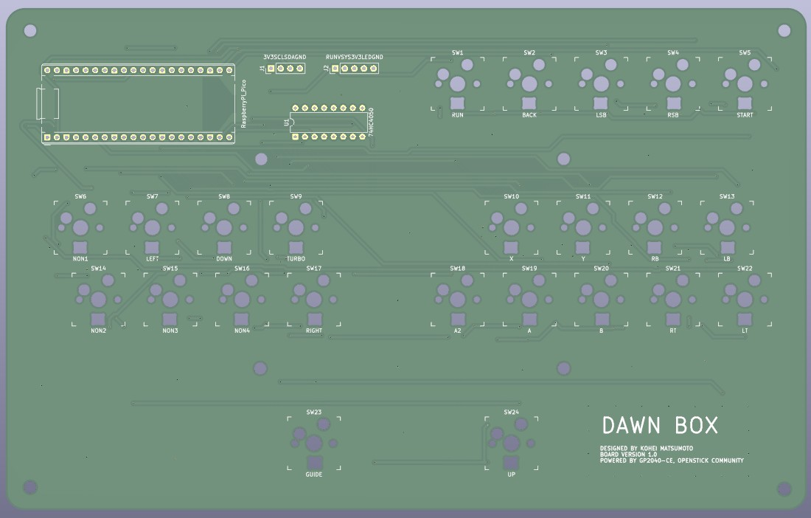
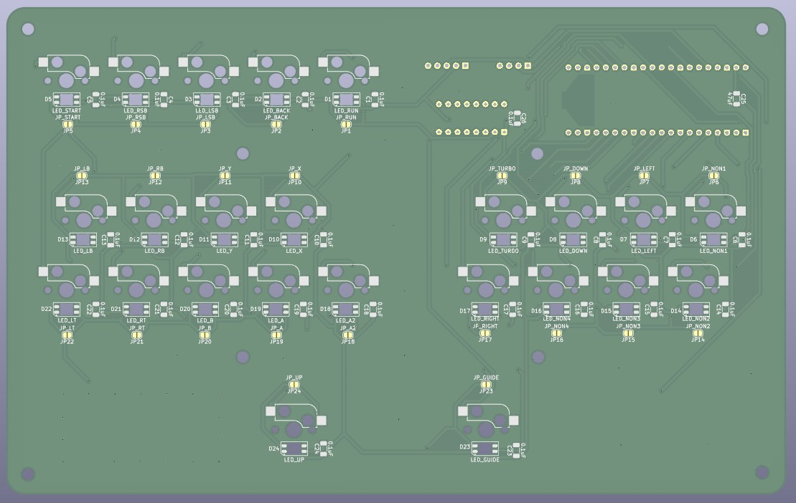
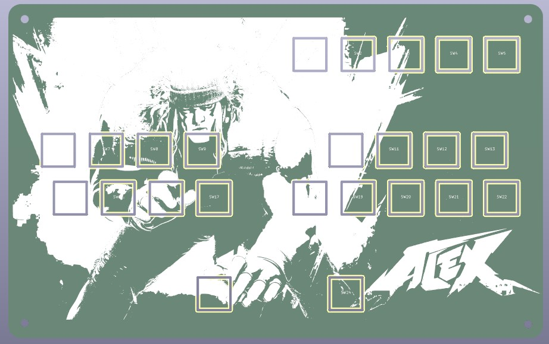
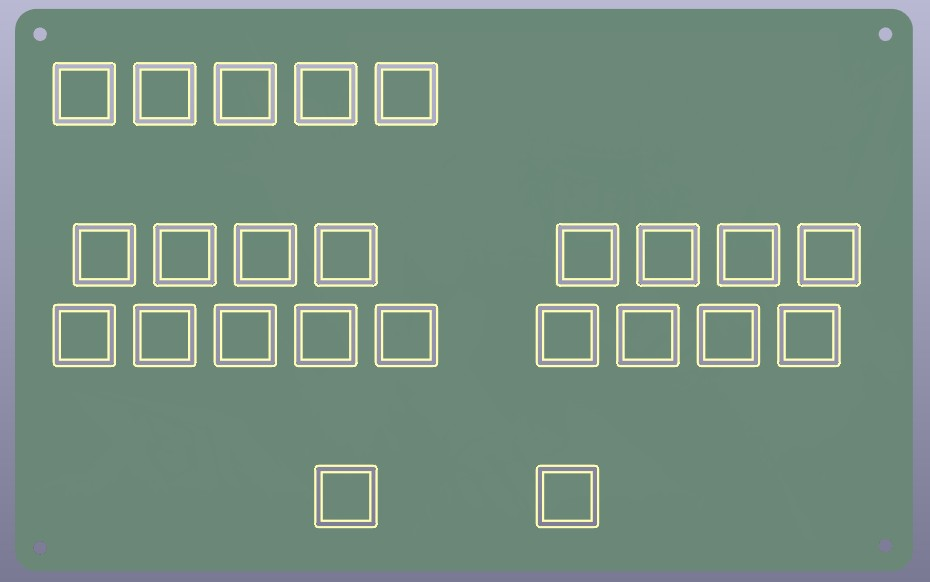

# DIY Leverless Arcade Controller

A custom, budget-friendly 24-button leverless arcade controller featuring an aluminum top plate with custom *Street Fighter 6* Alex artwork, Kailh MX mechanical switches (hot-swappable), MX-compatible keycaps, SK6812MINI-E RGB LEDs, a 0.96" I2C OLED display, and an exposed custom PCB design secured with M3 standoffs. Fully routed in KiCad, manufactured by JLCPCB, and powered by Raspberry Pi Pico with GP2040-CE.

## 📸 Gallery / Previews

### Main PCB

| Top View (Front) | Bottom View (Back) |
| :---: | :---: |
|  |  |

### Aluminum Top Plate

| Top View (Front with Alex Artwork) | Bottom View (Back) |
| :---: | :---: |
|  |  |

## 📌 Project Overview

This project focuses on building a high-performance, low-latency, and cost-effective 24-button leverless controller from scratch. By wiring 24 switches directly to the Raspberry Pi Pico without a diode matrix, this design achieves instantaneous input response. The controller features a rigid aluminum top plate detailed with custom silkscreen character artwork, a 0.96-inch status display, and a sleek, minimalist exposed PCB design held together firmly by industrial-standard M3 mounting hardware.

## 🎯 Key Features & Technical Specs

*   **Custom Alex (SF6) Artwork**: The aluminum top plate features high-detail silkscreen artwork of **Alex from Street Fighter 6**, making it a truly personalized piece of hardware.
*   **24-Button Layout**: A comprehensive 24-button matrix designed for modern fighting games and macro layouts.
*   **Firmware**: Powered by [GP2040-CE](https://gp2040-ce.info), offering ultra-low latency and multi-platform compatibility.
*   **Controller**: Uses a **Raspberry Pi Pico** (RP2040) as the main MCU.
*   **No Diodes (Direct Connection)**: All 24 switches are wired directly to individual GPIO pins on the Pico, maximizing responsiveness and avoiding ghosting without a matrix.
*   **Aluminum Top Plate**: Utilizes an aluminum plate manufactured by **JLCPCB** as the top enclosure for a premium, rigid, and durable finish.
*   **Exposed PCB Case Design**: Minimalist aesthetic with exposed sides and bottom, utilizing heavy-duty **M3 spacers/standoffs** directly attached via M3 mounting holes routed into the main board and top plate.
*   **Hot-Swappable Switches**: Uses **Kailh MX-compatible switches** with **Kailh hot-swap sockets**, allowing easy switch replacement without soldering.
*   **Keycaps**: Designed specifically for standard **MX-compatible keycaps**.
*   **0.96" I2C OLED Display**: Features an onboard **128x64 OLED screen (SSD1306)** connected via a dedicated 4-pin header interface to display real-time input history, active profiles, SOCD modes, and connection status. (No external pull-up resistors required).  (Optional)
*   **RGB LED Power & Stability**: LEDs are powered directly via the Pico's **VSYS pin** (5V). The power rail is stabilized with a **47μF SMD 1206 (3216)** bulk capacitor alongside individual **0.1μF SMD 1206 (3216)** decoupling capacitors for each LED to handle voltage fluctuations.  (Optional)
*   **Level Shifter Circuit**: Integrates a **74HC4050** hex buffer to safely step up the Pico's 3.3V data signal to 5V for reliable LED operation. (Optional)

## 📦 Design Libraries & Footprints

The following external libraries and specific footprints were used in KiCad for this project:

*   **Main PCB Switch Sockets**: 
    *   Library: [daprice/keyswitches.pretty](https://github.com)
    *   Footprint: `Kailh_socket_MX.kicad_mod` (For MX hotswap sockets)
*   **Top Plate Switch Cutouts**:
    *   Library: [foostan/kbd (kbd.pretty)](https://github.com)
    *   Footprint: `keyswitch_hole.kicad_mod` (For precise aluminum switch plate holes)

## 🛠️ Work Process & Status

### 1. Keyboard Layout & Artwork Design
*   Created a custom 24-button ergonomic layout using [Keyboard Layout Editor (KLE)](http://keyboard-layout.org).
*   Optimized button spacing for comfortable hand placement and optimal reaction times.
*   Prepared vector line art of *Street Fighter 6* Alex to be imported into the KiCad silkscreen layer.

### 2. Schematic & PCB / Plate Design (KiCad)
*   Imported layout data and mapped 24 direct GPIO lines from the Pico to each switch in **KiCad**.
*   Added a 4-pin male pin header (GND, VCC, SCL, SDA) for the 0.96" OLED module.
*   Configured the 74HC4050 level shifter circuit and added the 47μF bulk capacitor (1206 size) near the VSYS power entry point, with individual 0.1μF 1206 decoupling capacitors routed close to each LED.
*   Placed precise **M3 mounting holes** strategically across the board to ensure rigid structural support.
*   Designed the aluminum top enclosure plate using the exact same switch layout and M3 hole coordinates, then overlaid the Alex artwork onto the silkscreen layer.
*   Generated Gerber, drill, and production files optimized for JLCPCB specifications (both for the main PCB and the aluminum plate).

### 3. Manufacturing (JLCPCB)
*   Uploaded Gerber files to **JLCPCB** for both main PCB fabrication and aluminum plate cutting (specified as an Aluminum PCB layer with custom silkscreen).
*   *(Optional)* Utilized JLCPCB SMT Assembly service for surface-mount components (74HC4050, SK6812MINI-E, 1206 Capacitors).

### 4. Assembly & Firmware Flashing
*   *Next Step*: Solder remaining components (Kailh MX hot-swap sockets, Raspberry Pi Pico, 4-pin Male Pin Header).
*   *Next Step*: Flash the latest GP2040-CE firmware onto the Pico.
*   *Next Step*: Assemble the structural **M3 spacers/standoffs** onto the main PCB.
*   *Next Step*: Mount the custom Alex aluminum top plate using M3 screws, pop in the 24 Kailh MX switches, plug the 0.96" OLED display into the pin header, and attach the MX-compatible keycaps.
*   *Next Step*: Configure pin mappings, I2C display settings, and LED profiles via the GP2040-CE Web Configurator.

## 🧱 Bill of Materials (BOM)

| Component           | Description                                      | Qty   | Note |
| :---                | :---                                             | :---  | :--- |
| **Main PCB**        | Custom designed board manufactured by **JLCPCB** | 1     | -    |
| **Top Plate**       | Custom Aluminum plate with Alex artwork (JLCPCB) | 1     | -    |
| **MCU**             | Raspberry Pi Pico (RP2040)                       | 1     | -    |
| **Sockets**         | Kailh MX Hot-swap Sockets                        | 24    | -    |
| **Keycaps**         | MX-compatible keycaps                            | 24    | -    |
| **Switches**        | Kailh MX-compatible Mechanical Switches          | 24    | -    |
| **M3 Standoffs**    | Female-Female Spacers for enclosure stability    | 8     | -    |
| **M3 Screws**       | Screws to secure the PCB and Aluminum Top Plate  | 16    | -    |
| **IC**              | 74HC4050 (Level Shifter for LEDs)                | 1     | Optional |
| **LEDs**            | SK6812MINI-E (Addressable RGB)                   | 24    | Optional |
| **Bulk Cap**        | 47μF SMD 1206 (3216 Metric) Ceramic Capacitor    | 1     | Optional |
| **Decoupling Caps for LEDs** | 0.1μF SMD 1206 (3216 Metric) Ceramic Capacitors | 24   | Optional |
| **Decoupling Caps for 74HC** | 0.1μF SMD 1206 (3216 Metric) Ceramic Capacitors | 1    | Optional |
| **Decoupling Caps for MCU**  | 47μF SMD 1206 (3216 Metric) Ceramic Capacitors  | 1    | Optional |
| **Display**         | 0.96" I2C OLED Module (128x64 SSD1306 / 4-pin)   | 1     | Optional |
| **Header Pins**     | 1x4 Male Pin Header (2.54mm pitch) for OLED      | 1     | Optional |

